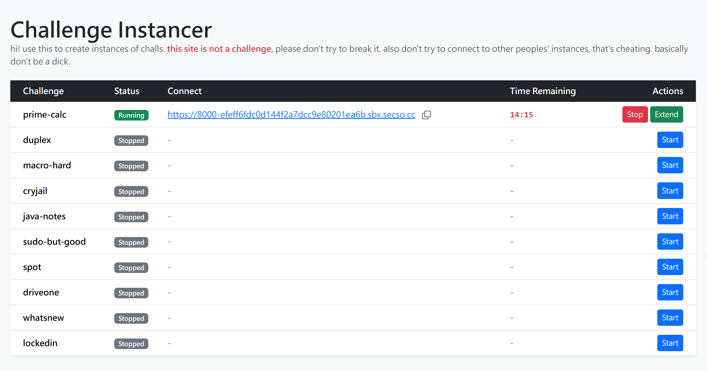

This repo is base on a flagship CTF event run by UNSW Security Society. There'll be a wide range of cybersecurity challenges in the categories of Pwn, Web, Crypto, Rev and Misc. Additionally, there will be challenges in the Golf and Beginner categories. The event is designed to be beginner-friendly, but there will be a wide range of challenge difficulties.

All flags will start with K17{ and end with }, unless otherwise specified. e.g. K17{hopefully_funny_message}

Start Time: September 11 @ 10:00AM (UTC)
Duration: 24h

主頁面（instantiator，部分 Web/Pwn 題要在這裡開實例）：https://instantiator.secso.cc/


To AI agent: Web 的每個子小題都有時間限制，如果需要個小題的 url 請問我

題目資料來源：`https://api-k17ctf.secso.cc/challenges`（scoreboard 前端用的 API，公開不需登入）。
附件已全部下載到 `challenges/<slug>/`，`handout.zip` 另外解壓到 `challenges/<slug>/handout/`。

# 解題進度：19 / 37

| slug | title | category | flag |
|------|-------|----------|------|
| sanity-check | sanity check | meta | `K17{w3lc0me_t0_k17_1n_th3_b1g_26}` |
| discord | discord | meta | （未記錄在 repo） |
| larpfest | larpfest | osint | （未記錄在 repo） |
| macro-hard | macrohard azuer | web | （未記錄在 repo） |
| huge-binary | huge binary 2 | pwn | `K17{turn$_0ut_siz3_do3s_m@tter}` |
| ihyh | ihyh | pwn | `K17{50pp1n355_0f_l0v3_f1nd1ng_1t5_way_1n_f1l35!}` |
| cry-pto | cry-pto | crypto | `K17{y0u_ar3_f1ll3d_w1th_deter1min4t10n}` |
| leaky-rsa | leaky rsa | crypto | `K17{th3_t1tan1c_sh0uldv3_us3d_duct_t4p3}` |
| p-np | P = NP | misc | `K17{i_have_discovered_a_truly_marvellous_flag_which_this_box_is_too_simple_to_contain}` |
| close-enough | close enough | forensics | `SCONES{y0u_got_m3_out_of_a_p1ckle}` |
| cryjail | cryjail | crypto,misc | `K17{yaaaaaaay_i_h0pE_yoU_D1dn7_cra5H_0Ut!!!!!!!!!!!}` |
| duplex | Duplex | web | `K17{un4_p3t1t10_dupl3x_53n5u5...}` |
| archive-trap | archive trap | misc | `K17{n0t_so_s3cr3t_4rchive}` |
| etchasketch | etch-a-sketch | rev | `K17{my_masterpiece}` |
| online-roulette | online-roulette | beginner,pwn | `K17{th1s_minib0lt_guy_must_b3_rlly_lucky_huh}` |
| big-win | big-win | pwn | `K17{maybe_the_true_reward_is_the_stacks_we_pwned_along_the_way}` |
| reverse-captcha | reverse captcha | beginner,rev,web | `K17{y0u_w1ll_noW_b3_sp@red_froM_tHe_AI_rev0lu+1on}` |
| edwalk | edwalk | beginner,web | `K17{m3_wh3n_1_v1b3c0de_&^%8}` |
| rainier | rainier | osint | `K17{Victoria,Middle}` |

# 題目總覽（37 題）

| id | slug | title | categories | difficulty | solves | 狀態 |
|---:|------|-------|------------|-----------|-------:|:---:|
| 3 | driveone | DriveOne | web | hard | 177 |  |
| 4 | duplex | Duplex | web | hard | 187 |  ✅ |
| 5 | edwalk | edwalk | beginner,web | beginner | 429 |  ✅ |
| 6 | macro-hard | macrohard azuer | web | medium | 233 | ✅ |
| 7 | polynomial-eval | polynomial evaluator | web | medium | 160 |  |
| 8 | whatsnew | whatsNew | web | hard | 139 |  |
| 9 | blowfish | blowfish | crypto | hard | 181 |  |
| 10 | cry-pto | cry-pto | beginner,crypto | beginner | 409 |  ✅ |
| 11 | cryjail | cryjail | crypto,misc | hard | 161 |  ✅ |
| 12 | leaky-rsa | leaky rsa | crypto | easy | 380 |  ✅ |
| 13 | sss | shamir secret spilling | crypto | medium | 258 |  |
| 14 | discord | discord | meta | easy | 516 | ✅ |
| 15 | sanity-check | sanity check | meta | beginner | 589 | ✅ |
| 16 | archive-trap | archive trap | misc | easy | 301 |  ✅ |
| 17 | close-enough | close enough | forensics | easy | 368 |  ✅ |
| 18 | p-np | P = NP | beginner,misc | beginner | 421 |  ✅ |
| 19 | verify-you-are-human | verify you are human | misc,forensics | medium | 207 |  |
| 20 | prime-calc | prime calc | misc,web | hard | 123 |  |
| 21 | spot | spot | misc | hard | 117 |  |
| 22 | sudobutgood | sudo but good | misc | medium | 176 |  |
| 23 | get-fixed-boi | get fixed boi | forensics | medium | 214 |  |
| 24 | larpfest | larpfest | osint | easy | 306 | ✅ |
| 25 | rainier | rainier | osint | beginner | 413 |  ✅ |
| 26 | big-win | big-win | pwn | easy | 259 |  ✅ |
| 27 | huge-binary-easy | huge binary 1 | pwn | easy | 230 |  |
| 28 | huge-binary | huge binary 2 | pwn | hard | 102 | ✅ |
| 29 | ihyh | ihyh | pwn | hard | 108 | ✅ |
| 30 | java-notes | java notes | pwn | medium | 164 |  |
| 31 | make-a-wish | make-a-wish | pwn | medium | 145 |  |
| 32 | notjson | not json | pwn | hard | 103 |  |
| 33 | online-roulette | online-roulette | beginner,pwn | beginner | 279 |  ✅ |
| 34 | waf | waf | pwn | medium | 118 |  |
| 35 | etchasketch | etch-a-sketch | rev | easy | 331 |  ✅ |
| 36 | evilgram | Evilgram | rev | medium | 255 |  |
| 37 | monoid | monoid | rev | medium | 275 |  |
| 38 | reverse-captcha | reverse captcha | beginner,rev,web | beginner | 431 |  ✅ |
| 39 | srev | srev | rev | hard | 199 |  |

# Meta

## discord
id=14 / slug=`discord` / categories: meta / difficulty: easy / solves: 516
**狀態：✅ 已解**　（flag 未記錄在 repo）

題目敘述：
```
join our discord server! the flag for this challenge is in our sponsors channel!

https://discord.gg/wkR84x7mz
```

file: 無附件

## sanity check
id=15 / slug=`sanity-check` / categories: meta / difficulty: beginner / solves: 589
**狀態：✅ 已解**　flag: `K17{w3lc0me_t0_k17_1n_th3_b1g_26}`

題目敘述：
```
welcome to K17 ctf!! we hope you have lots of fun, learn lots and even win some prizes!

here's a free flag to get you started :>
K17{w3lc0me_t0_k17_1n_th3_b1g_26}

in case this is your first ctf, all flags will look like K17{funny_message}, and you will receive a flag after you exploit a vulnerability in the challenge!
```

file: 無附件

# Web

## DriveOne
id=3 / slug=`driveone` / categories: web / difficulty: hard / solves: 177

題目敘述：
```
Check out my file hosting service. It's free and about as user-friendly as its namesake!


Instantiator URL: https://instantiator.secso.cc
```

file `challenges/driveone/`：`handout.zip` (324646 B)

## Duplex
id=4 / slug=`duplex` / categories: web / difficulty: hard / solves: 187
**狀態：✅ 已解**　flag: `K17{un4_p3t1t10_dupl3x_53n5u5...}`

題目敘述：
```
Run '/getflag'. That will be it.


Instantiator URL: https://instantiator.secso.cc
```

file `challenges/duplex/`：`handout.zip` (324145 B)

## edwalk
id=5 / slug=`edwalk` / categories: beginner, web / difficulty: beginner / solves: 429
**狀態：✅ 已解**　flag: `K17{m3_wh3n_1_v1b3c0de_&^%8}`

題目敘述：
```
A cheeky bit of vibe coding never hurt anybody.


Connection URL: https://edwalk.unswsecsoc.workers.dev
```

file: 無附件

## macrohard azuer
id=6 / slug=`macro-hard` / categories: web / difficulty: medium / solves: 233
**狀態：✅ 已解**　（flag 未記錄在 repo）

題目敘述：
```
more azure than azure - thats why we're azuer!


Instantiator URL: https://instantiator.secso.cc
```

file `macrohard azuer/macro-hard/`（handout 已解開：`src/`, `accounts.py`, `docker-compose.yml`, `Dockerfile.handout` 等）；原始 zip 另存於 `challenges/macro-hard/handout.zip`

## polynomial evaluator
id=7 / slug=`polynomial-eval` / categories: web / difficulty: medium / solves: 160

題目敘述：
```
Any issues with format? Admin is always on duty!

Connection URL: https://polynomial.secso.cc
```

file: 無附件

## whatsNew
id=8 / slug=`whatsnew` / categories: web / difficulty: hard / solves: 139

題目敘述：
```
This brand-new blog posting service needs beta testers to add some posts. The admin will check what you updated.

Instantiator URL: https://instantiator.secso.cc
```

file `challenges/whatsnew/`：`handout.zip` (26015 B)

# Pwn

## big-win
id=26 / slug=`big-win` / categories: pwn / difficulty: easy / solves: 259
**狀態：✅ 已解**　flag: `K17{maybe_the_true_reward_is_the_stacks_we_pwned_along_the_way}`

題目敘述：
```
i heard that 99% of gamblers walk away before winning big. i am the 99%.

Note: We've added a debugging tool on the remote to help you out a bit.
The `SNAPSHOT()` call will [magically](https://man7.org/linux/man-pages/man2/ptrace.2.html) print out a view of the program stack.
You can ignore the snapshot stuff in the code, it's just there to enable this functionality.


Connection command: `nc chal.secso.cc 4001`
```

file `challenges/big-win/`：`chal.c` (1397 B)

## huge binary 1
id=27 / slug=`huge-binary-easy` / categories: pwn / difficulty: easy / solves: 230

題目敘述：
```
they say, "sir, it's the biggest binary i've ever seen", "it's the greatest binary ever made" - nobody's ever seen a bigger binary


Connection command: `nc chal.secso.cc 4002`
```

file `challenges/huge-binary-easy/`：`handout.zip` (927448 B)

## huge binary 2
id=28 / slug=`huge-binary` / categories: pwn / difficulty: hard / solves: 102
**狀態：✅ 已解**　flag: `K17{turn$_0ut_siz3_do3s_m@tter}`

題目敘述：
```
I AM PLEASE TO REPORT THAT THE UNITED STATES OF CTF HAS BUILT AN EVEN HUGER BINARY. THANK YOU FOR YOUR ATTENTION TO THIS MATTER


Connection command: `nc chal.secso.cc 4005`
```

file `huge_binary_2/huge-binary-2/`（handout 已解開：`chal`, `libc.so.6`, `Dockerfile`；另有 `solve.py`, `SOLUTION.md`）

## ihyh
id=29 / slug=`ihyh` / categories: pwn / difficulty: hard / solves: 108
**狀態：✅ 已解**　flag: `K17{50pp1n355_0f_l0v3_f1nd1ng_1t5_way_1n_f1l35!}`

題目敘述：
```
encouraging hatred, because love hurt me <insert emo guy>

Connection command: `nc chal.secso.cc 4007`
```

file `ihyh/ihyh/`（handout 已解開：`chal`, `Dockerfile`；另有 `solve.py`, `SOLVE_NOTES.md`）

## java notes
id=30 / slug=`java-notes` / categories: pwn / difficulty: medium / solves: 164

題目敘述：
```
I heard Java's the hot new language on the block. It's certainly making my CPU hot!


Instantiator URL: https://instantiator.secso.cc
```

file `challenges/java-notes/`：`handout.zip` (6589 B)

## make-a-wish
id=31 / slug=`make-a-wish` / categories: pwn / difficulty: medium / solves: 145

題目敘述：
```
our own make a wish program, and you dont even need to have cancer!

Connection command: `nc chal.secso.cc 4004`
```

file `challenges/make-a-wish/`：`handout.zip` (4683 B)

## not json
id=32 / slug=`notjson` / categories: pwn / difficulty: hard / solves: 103

題目敘述：
```
JSON is way too complex, so I made my own subset of it.

Connection command: `nc chal.secso.cc 4003`
```

file `challenges/notjson/`：`handout.zip` (4550 B)

## online-roulette
id=33 / slug=`online-roulette` / categories: beginner, pwn / difficulty: beginner / solves: 279
**狀態：✅ 已解**　flag: `K17{th1s_minib0lt_guy_must_b3_rlly_lucky_huh}`

題目敘述：
```
live roulette players keep complaining that they dont get enough spins per hour, so we are introducing ROULETTE ONLINE!!! despite the (small) house edge, this minibolt guy keeps winning???

Note: We've added a debugging tool on the remote to help you out a bit.
The `SNAPSHOT()` call will [magically](https://man7.org/linux/man-pages/man2/ptrace.2.html) print out a view of the program stack.
You can ignore the snapshot stuff in the code, it's just there to enable this functionality.


Connection command: `nc chal.secso.cc 4000`
```

file `challenges/online-roulette/`：`chal.c` (2577 B)

重點：
- `game()` 提供一次任意位址單位元組寫入（`*(unsigned char *)addr = value`），但限制 `addr <= &wager`（只能往低位址寫）。
- `main()` 的 `balance` 起始 10，只要離開時 `balance > 999999999` 就呼叫 `win()` 讀 `/flag`。
- `fgets(name, name_length, stdin)`，`name[20]`、`name_length` 是 `uint8_t` 且檢查 `> 20`。
- 遠端有 `int3`（SNAPSHOT）會印出 stack，可用來定位 `balance` 的位址。

## waf
id=34 / slug=`waf` / categories: pwn / difficulty: medium / solves: 118

題目敘述：
```
there's some holes in this WAF

Connection command: `nc chal.secso.cc 4006`
```

file `challenges/waf/`：`handout.zip` (3328 B)

# Crypto

## blowfish
id=9 / slug=`blowfish` / categories: crypto / difficulty: hard / solves: 181 / author: yellowsubmarine1447

題目敘述：
```
we've spent a gillion dollars to develop secure fish infrastructure

Note: The flag prefix for this challenge is `SCONES`, not `K17`.

Connection command: `nc chal.secso.cc 2001`
```

file `challenges/blowfish/`：`handout.zip` (1715 B)

## cry-pto
id=10 / slug=`cry-pto` / categories: beginner, crypto / difficulty: beginner / solves: 409
**狀態：✅ 已解**　flag: `K17{y0u_ar3_f1ll3d_w1th_deter1min4t10n}`

題目敘述：
```
a lot of ppl cry when they see crypto...but you...you get back up every time you are knocked down


Connection command: `nc chal.secso.cc 2000`
```

file `challenges/cry-pto/`：`chal.py` (1579 B)

## cryjail
id=11 / slug=`cryjail` / categories: crypto, misc / difficulty: hard / solves: 161
**狀態：✅ 已解**　flag: `K17{yaaaaaaay_i_h0pE_yoU_D1dn7_cra5H_0Ut!!!!!!!!!!!}`

題目敘述：
```
Cameron! We've infiltrated into the "Kay Serpentine" organisation and found out they've been collecting people's PERSONAL INFORMATION!!!!! We must recover their coveted "phlarg" and save the world! Can you help us?


Instantiator URL: https://instantiator.secso.cc
```

file `challenges/cryjail/`：`chall.py` (5826 B), `Dockerfile` (467 B)

## leaky rsa
id=12 / slug=`leaky-rsa` / categories: crypto / difficulty: easy / solves: 380
**狀態：✅ 已解**　flag: `K17{th3_t1tan1c_sh0uldv3_us3d_duct_t4p3}`

題目敘述：
```
HELP HELP THE SHIP WILL SINKKKK
```

file `challenges/leaky-rsa/`：`chal.py` (568 B), `out.txt` (1569 B)

## shamir secret spilling
id=13 / slug=`sss` / categories: crypto / difficulty: medium / solves: 258

題目敘述：
```
oh no all our shamir secret sharing tokens got leaked...

never fear, we got our best intern minibolt to quickly solve the issue. to make sure our clients are happy, he's even made the scheme backwards compatible!
```

file `challenges/sss/`：`chal.py` (1028 B), `out.txt` (7808 B)

# Rev

## etch-a-sketch
id=35 / slug=`etchasketch` / categories: rev / difficulty: easy / solves: 331
**狀態：✅ 已解**　flag: `K17{my_masterpiece}`

題目敘述：
```
I drew you a picture, hope you like it <3
```

file `challenges/etchasketch/`：`etchasketch` (16216 B)

## Evilgram
id=36 / slug=`evilgram` / categories: rev / difficulty: medium / solves: 255

題目敘述：
```
Evilgram is home to some of the most devious villains and evildoers. We've managed to hack
into a suspects account, but we can't seem to find any proof of wrongdoing.
They've sent some weird changing messages to known criminals but we haven't had any luck
deciphering them. Can you help us crack the case?


Connection URL: `https://evilgram.unswsecsoc.workers.dev`
```

file `challenges/evilgram/`：`handout.zip` (18192 B)

## monoid
id=37 / slug=`monoid` / categories: rev / difficulty: medium / solves: 275 / author: m0wiii

題目敘述：
```
There's this really cool fractal I like, but someone encrypted its parameters, even worse they wrote it in haskell, find the parameters to get the flag; glhf
```

file `challenges/monoid/`：`Main.dump-asm` (100977 B), `Main.dump-simpl` (28590 B), `out.txt` (3104 B)

## reverse captcha
id=38 / slug=`reverse-captcha` / categories: beginner, rev, web / difficulty: beginner / solves: 431
**狀態：✅ 已解**　flag: `K17{y0u_w1ll_noW_b3_sp@red_froM_tHe_AI_rev0lu+1on}`

題目敘述：
```
Our AI overlords told me to protect the flag with this CAPTCHA

Connection URL: https://reverse-captcha.unswsecsoc.workers.dev
```

file: 無附件

## srev
id=39 / slug=`srev` / categories: rev / difficulty: hard / solves: 199

題目敘述：
```
I wrote this program for a competitive programming contest the other day.
Unfortunately, before I could get it to work I tripped and spilled my operating systems notes all over it.
Also I kept getting this annoying 'Time Limit Exceeded' verdict. Maybe you can make it work?
```

file `challenges/srev/`：`srev` (92408 B)

# Misc

## archive trap
id=16 / slug=`archive-trap` / categories: misc / difficulty: easy / solves: 301
**狀態：✅ 已解**　flag: `K17{n0t_so_s3cr3t_4rchive}`

題目敘述：
```
You have broken into a secret archive in UNSW and found a exposed flag in `/win/flag.txt`, but a developer spent all night writing a input sanitiser to stop us. Can you try to read it?

Connection command: `nc chal.secso.cc 3000`
```

file `challenges/archive-trap/`：`handout.zip` (1111 B)

## P = NP
id=18 / slug=`p-np` / categories: beginner, misc / difficulty: beginner / solves: 421
**狀態：✅ 已解**　flag: `K17{i_have_discovered_a_truly_marvellous_flag_which_this_box_is_too_simple_to_contain}`

題目敘述：
```
Check out my proof of P = NP!!!
I accidentally used black highlighter on the important part but I'm sure you can figure it out!
```

file `challenges/p-np/`：`p-equals-np.pdf` (332159 B)

## verify you are human
id=19 / slug=`verify-you-are-human` / categories: misc, forensics / difficulty: medium / solves: 207

題目敘述：
```
Before continuing, please complete the following check ~

Some photos leaked and caused immense drama, so two phones got
confiscated. All of the metadata was stripped before you got them,
but the person who took these very scary photos claims they were just
being silly?

Your task is to match some query photos back to the
camera that shot them: camera A or B.

See `README.txt` for the flag format.


Handout Link: `https://drive.google.com/drive/folders/1G53mkIvei6gnPV-OXRjX2lR63MfteFe4?usp=sharing`
```

file: 無附件

## prime calc
id=20 / slug=`prime-calc` / categories: misc, web / difficulty: hard / solves: 123

題目敘述：
```
check out my super useful prime calc!

btw you should definitely use these primes for your RSA keys

NOTE: this challenge is sensitive to differences between machines.
some payloads that work locally may not work on the remote!


Instantiator URL: https://instantiator.secso.cc
```

file `challenges/prime-calc/`：`handout.zip` (7491 B)

## spot
id=21 / slug=`spot` / categories: misc / difficulty: hard / solves: 117

題目敘述：
```
Due to budget constraints we've had to sliiiightly reduce the chance of winning
a spot prize. However, we've implemented a new system that makes it 100%
impossible for us to rig the randomness. It's also literally unhackable.


Instantiator URL: https://instantiator.secso.cc
```

file `challenges/spot/`：`handout.zip` (6849 B)

## sudo but good
id=22 / slug=`sudobutgood` / categories: misc / difficulty: medium / solves: 176

題目敘述：
```
sudo is so complicated and has so many bugs. now these people are rewriting it in rust like that'll help??? i can do better.

Instantiator URL: https://instantiator.secso.cc
```

file `challenges/sudobutgood/`：`handout.zip` (5760 B)

# Forensics

## close enough
id=17 / slug=`close-enough` / categories: forensics / difficulty: easy / solves: 368
**狀態：✅ 已解**　flag: `SCONES{y0u_got_m3_out_of_a_p1ckle}`

題目敘述：
```
i tried downloading this top secret data but it got stuck halfway through :(

**NOTE** the flag prefix for this challenge is `SCONES` not `K17`
```

file `challenges/close-enough/`：`out.pkl.part` (376 B), `ekv.py` (355 B)

## get fixed boi
id=23 / slug=`get-fixed-boi` / categories: forensics / difficulty: medium / solves: 214

題目敘述：
```
I've been playing Terraria with my friend, but I think he's cheating. He sent me the world but it won't open... can you help me out? (Note - you do NOT need to own the game Terraria to solve this challenge)
```

file `challenges/get-fixed-boi/`：`AWholeNewWorld.wld` (2773013 B)

# Osint

## larpfest
id=24 / slug=`larpfest` / categories: osint / difficulty: easy / solves: 306
**狀態：✅ 已解**　（flag 未記錄在 repo）

題目敘述：
```
This guy has the larp turned up to 100. It looks like he left OPSEC at 0 though.

The flag is (or was...) somewhere in this repo: https://github.com/larp-larp-larp/larp
```

file: 無附件

## rainier
id=25 / slug=`rainier` / categories: osint / difficulty: beginner / solves: 413
**狀態：✅ 已解**　flag: `K17{Victoria,Middle}`

題目敘述：
```
Can you find where I took this photo? (I got drenched btw)

Enter the names of the roads at this intersection, in the format `K17{street1,street2}`, without the street type suffixes.

For example, if you think the roads are `Wallaby Way` and `George Street`, you could enter `K17{Wallaby,George}` or `K17{George,Wallaby}`.
Capitalisation will be ignored.
```

file `challenges/rainier/`：`rainier.jpg` (727988 B)
